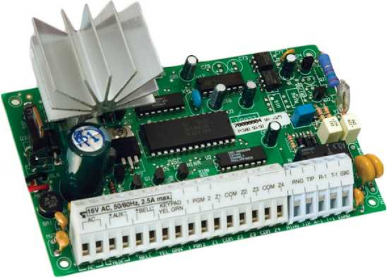
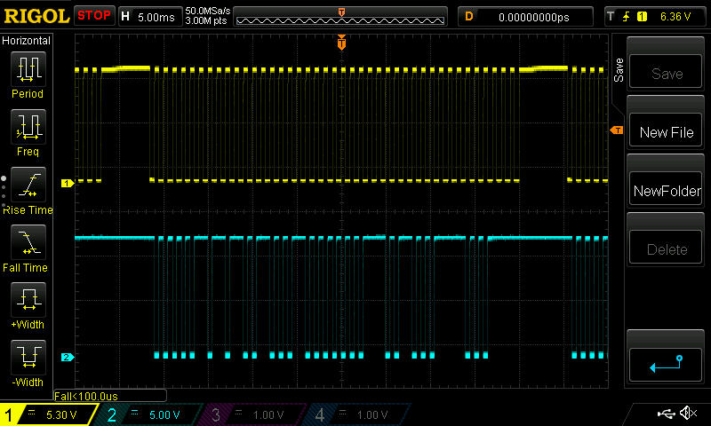
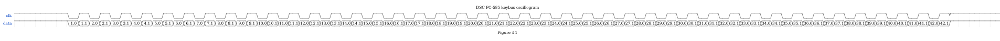

DSC PC-585 keybus description.

### Summary:

1. [Description](#description)
2. [DSC_PC585 Series keybus oscillogram](#oscillogram)
3. [DSC_PC585 Series keybus description](#keybus)
------------------------------------------------------------------------------------------------------------------
### Description:

 <!-- .element height="50%" width="50%" -->

[Back](#summary)

------------------------------------------------------------------------------------------------------------------
### Keybus electrical characteristics:

- Clock period : T = 1ms
- Max voltage : Umax = 12V (Logical 1)
- Min voltage : Umin = 0V (Logical 0)
- Pulses count: 42
- Packet length : ~42 ms
- Delay between packets : ~5ms
- Bit duration : 0.5ms (T/2)

##### Keybus consists of 4 wires:

- Red : +12v
- Yellow: Clock
- Green: Data
- Black : Gnd

##### Keybus oscillogram (click to enlarge):

 <!-- .element height="50%" width="50%" -->

##### Keybus description (click to enlarge):

 <!-- .element height="50%" width="50%" -->

Description:

| Pulse No | Represents | Description [ logical state ] | Additional info |
|:--------------|:----------------:|:----------------:|:----------------:|
|1.0| | | |
|1.1| | | |
|2.0| | | |
|2.1| | | |
|3.0| | | |
|3.1| | | |
|4.0| | | |
|4.1| | | |
|5.0| | | |
|5.1| | | |
|6.0| | | |
|6.1| | | |
|7.0| | | |
|7.1| | | |
|8.0| | | |
|8.1| | | |
|9.0| | | |
|9.1| | | |
|10.0|Button 1,2,3,4,5,6,7,8,9,*,0,#|Pushed[0], not pushed[1]| |
|10.1| | | |
|11.0|Button 1,2,3,4,5,6,7,8,9,*,0,#|Pushed[0], not pushed[1]| |
|11.1| | | |
|12.0|Button 1,2,3,4,5,6,7,0|Pushed[0], not pushed[1]| |
|12.1| | | |
|13.0|Button 1,2,3,8,9,*,0,#|Pushed[0], not pushed[1]| |
|13.1| | | |
|14.0|Button 1,4,5,8,9,0|Pushed[0], not pushed[1]| |
|14.1| | | |
|15.0|Button 2,4,6,8,*,0|Pushed[0], not pushed[1]| |
|15.1| | | |
|16.0|Button 1,4,7,*,0,#|Pushed[0], not pushed[1]| |
|16.1| | | |
|17.0|Button 2,5,7,8,*,0|Pushed[0], not pushed[1]| |
|17.1| | | |
|18.0| | | |
|18.1|Restore delay after failure|Restored[0], paused[1]| |
|19.0| | | |
|19.1| | | |
|20.0| | | |
|20.1| | | |
|21.0| | | |
|21.1| | | |
|22.0| | | |
|22.1|Restore delay after failure|Restored[0], paused[1]| |
|23.0| | | |
|23.1|Restore delay after failure|Restored[0], paused[1]| |
|24.0| | | |
|24.1|Restore delay after failure|Restored[0], paused[1]| |
|25.0| | | |
|25.1| | | |
|26.0| | | |
|26.1| | | |
|27.0| | | |
|27.1| | | |
|28.0| | | |
|28.1| | | |
|29.0| | | |
|29.1| | | |
|30.0| | | |
|30.1| | | |
|31.0| | | |
|31.1| | | |
|32.0| | | |
|32.1| | | |
|33.0| | | |
|33.1| | | |
|34.0| | | |
|34.1| | | |
|35.0| | | |
|35.1| | | |
|36.0| | | |
|36.1| | | |
|37.0| | | |
|37.1| | | |
|38.0| | | |
|38.1| | | |
|39.0| | | |
|39.1| | | |
|40.0| | | |
|40.1| | | |
|41.0| | | |
|41.1| | | |
|42.0| | | |
|42.1| | | |

**Unfortunatelly, not all functions of keybus were reversed, but we are working on that :)**

[Back](#summary)

------------------------------------------------------------------------------------------------------------------
