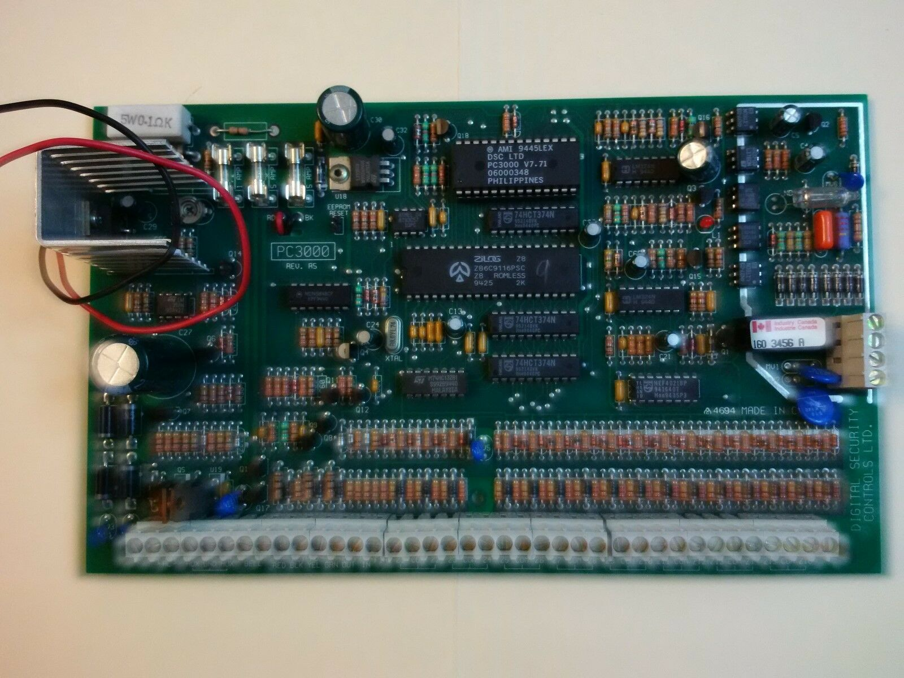
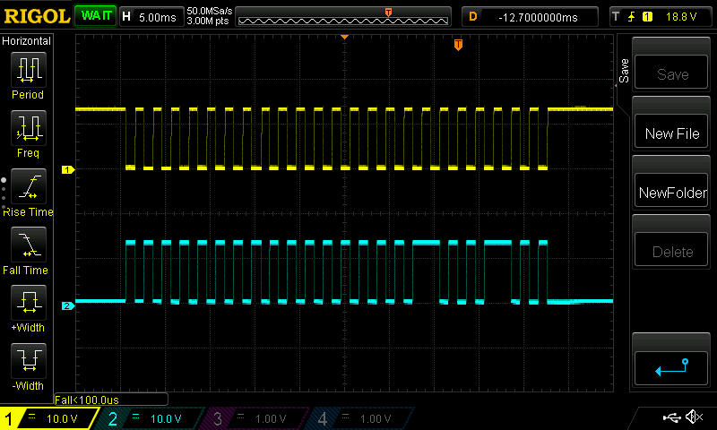
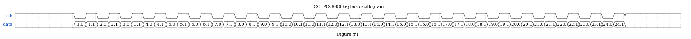

#DSC PC-3000 keybus description.

### Summary:

1. [Description](#description)
2. [DSC_PC3000 keybus oscillogram](#oscillogram)
3. [DSC_PC3000 keybus description](#keybus)

------------------------------------------------------------------------------------------------------------------
### Description:

 <!-- .element height="50%" width="50%" -->

[Back](#summary)

------------------------------------------------------------------------------------------------------------------
### Keybus electrical characteristics:

- Clock period : T = 2ms
- Max voltage : Umax = 12V (Logical 1)
- Min voltage : Umin = 0V (Logical 0)
- Pulses count: 24
- Packet length : ~48 ms
- Delay between packets : ~21ms
- Bit duration : 1ms (T/2)

##### Keybus consists of 4 wires:

- Red : +12v
- Yellow: Clock
- Green: Data
- Black : Gnd

##### Keybus oscillogram (click to enlarge):

 <!-- .element height="50%" width="50%" -->

##### Keybus description (click to enlarge):

 <!-- .element height="50%" width="50%" -->

Description:

| Pulse No | Represents | Description [ logical state ] | Additional info |
|:--------------|:----------------:|:----------------:|:----------------:|
|1.0|Button F,A,P|Pushed[0], not pushed[1]||
|1.1|Zone 1 LED|Led is on[1], led is off[0]| [1] - zone is opened, [0] - zone is closed  |
|2.0|Button 1,4,7,*,F|Pushed[0], not pushed[1]| |
|2.1|Zone 2 LED|Led is on[1], led is off[0]| [1] - zone is opened, [0] - zone is closed |
|3.0|Button 2,5,8,0,A|Pushed[0], not pushed[1]| |
|3.1|Zone 3 LED|Led is on[1], led is off[0]| [1] - zone is opened, [0] - zone is closed |
|4.0|Button 3,6,9,#,P|Pushed[0], not pushed[1]|  |
|4.1|Zone 4 LED|Led is on[1], led is off[0]| [1] - zone is opened, [0] - zone is closed |
|5.0|Button *,0,#|Pushed[0], not pushed[1]| |
|5.1|Zone 5 LED|Led is on[1], led is off[0]| [1] - zone is opened, [0] - zone is closed  |
|6.0|Button 7,8,9|Pushed[0], not pushed[1]|  |
|6.1|Zone 6 LED|Led is on[1], led is off[0]| [1] - zone is opened, [0] - zone is closed |
|7.0|Button 4,5,6|Pushed[0], not pushed[1]|  |
|7.1|Zone 7 LED|Led is on[1], led is off[0]| [1] - zone is opened, [0] - zone is closed |
|8.0|Button 1,2,3|Pushed[0], not pushed[1]| |
|8.1|Zone 8 LED|Led is on[1], led is off[0]| [1] - zone is opened, [0] - zone is closed |
|9.0| | | |
|9.1|Zone 9 LED|Led is on[1], led is off[0]| [1] - zone is opened, [0] - zone is closed |
|10.0| | | |
|10.1|Zone 10 LED|Led is on[1], led is off[0]| [1] - zone is opened, [0] - zone is closed |
|11.0| | | |
|11.1|Zone 11 LED|Led is on[1], led is off[0]| [1] - zone is opened, [0] - zone is closed |
|12.0| | | |
|12.1|Zone 12 LED|Led is on[1], led is off[0]| [1] - zone is opened, [0] - zone is closed |
|13.0| | | |
|13.1|Zone 13 LED|Led is on[1], led is off[0]| [1] - zone is opened, [0] - zone is closed |
|14.0| | | |
|14.1|Zone 14 LED|Led is on[1], led is off[0]| [1] - zone is opened, [0] - zone is closed |
|15.0| | | |
|15.1|Zone 15 LED|Led is on[1], led is off[0]| [1] - zone is opened, [0] - zone is closed |
|16.0| | | |
|16.1|Zone 16 LED|Led is on[1], led is off[0]| [1] - zone is opened, [0] - zone is closed |
|17.0| | | |
|17.1|Ready LED|Led is on[1], led is off[0]| Ready led |
|18.0| | | |
|18.1|Armed LED|Led is on[1], led is off[0]| Armed led |
|19.0| | | |
|19.1|Memory LED|Led is on[1], led is off[0]| Memory led |
|20.0| | | |
|20.1|Bypass LED|Led is on[1], led is off[0]| Bypass led |
|21.0| | | |
|21.1|Trouble LED|Led is on[1], led is off[0]| Trouble LED |
|22.0| | | |
|22.1|Program LED|Led is on[1], led is off[0]| Program LED |
|23.0| | | |
|23.1|Fire LED|Led is on[1], led is off[0]| Fire LED |
|24.0| | | |
|24.1|Buzzer|Buzzer is on[1], Buzzer is off[0]| Buzzer |

**Unfortunatelly, not all functions of keybus were reversed, but we are working on that :)**

[Back](#summary)

------------------------------------------------------------------------------------------------------------------
