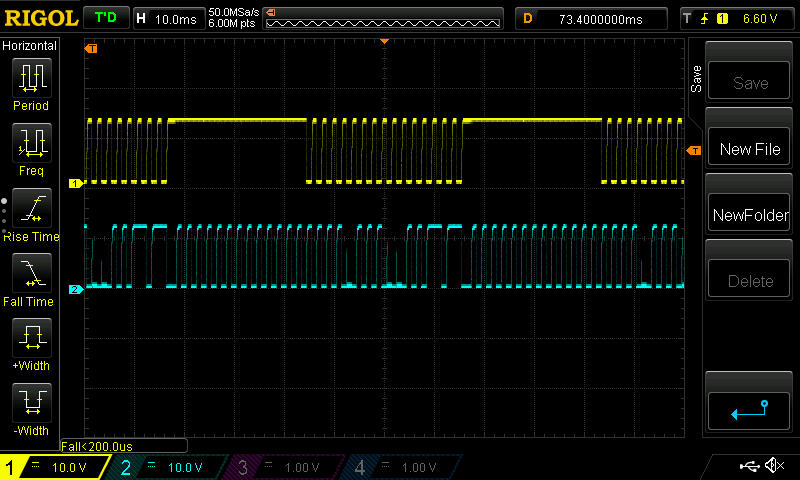

DSC PC-550 keybus description.

### Summary:

1. [Description](#description)
2. [DSC_PC550 keybus oscillogram](#oscillogram)
3. [DSC_PC550 keybus description](#keybus)

------------------------------------------------------------------------------------------------------------------
### Description:

 <!-- .element height="50%" width="50%" -->

[Back](#summary)

------------------------------------------------------------------------------------------------------------------
### Keybus electrical characteristics:

- Clock period : T = 2ms
- Max voltage : Umax = 12V (Logical 1)
- Min voltage : Umin = 0V (Logical 0)
- Pulses count: Clock - 16, Data - 16(active) + 13,5(inactive) //13,5 means that this packet piece has 14 positive and 13 negative pulses
- Packet length : Clock: ~32 ms, Data: Active - 32ms, Inactive - 27ms
- Delay between packets : Clock: ~27ms, Data - no delay or 1ms, if we want to count that half pulse in the end.
- Bit duration : 1ms (T/2)

##### Keybus consists of 4 wires:

- Red : +12v
- Yellow: Clock
- Green: Data
- Black : Gnd

##### Keybus oscillogram (click to enlarge):

 <!-- .element height="50%" width="50%" -->

##### Keybus description (click to enlarge):

 <!-- .element height="50%" width="50%" -->

Description:

| Pulse No | Represents | Description [ logical state ] | Additional info |
|:--------------|:----------------:|:----------------:|:----------------:|
|1.0|Button 2,4,6,8,*,0|Pushed[0], not pushed[1]|  |
|1.1| | | |
|2.0|Button 1,4,5,8,9,0|Pushed[0], not pushed[1]|  |
|2.1| | | |
|3.0|Button 1,2,3,8,9,*,0,#|Pushed[0], not pushed[1]|  |
|3.1| | | |
|4.0|Button 1,2,3,4,5,6,7,0|Pushed[0], not pushed[1]|  |
|4.1| | | |
|5.0| | | |
|5.1| | | |
|6.0|Button F|Pushed[0], not pushed[1]|  |
|6.1| | | |
|7.0|Button A|Pushed[0], not pushed[1]|  |
|7.1| | | |
|8.0|Button P|Pushed[0], not pushed[1]|  |
|8.1| | | |
|9.0| | | |
|9.1|Zone 1 LED|Led is on[1], led is off[0]| [1] - zone is opened, [0] - zone is closed |
|10.0| | | |
|10.1|Zone 2 LED|Led is on[1], led is off[0]| [1] - zone is opened, [0] - zone is closed |
|11.0| | | |
|11.1|Zone 3 LED|Led is on[1], led is off[0]| [1] - zone is opened, [0] - zone is closed |
|12.0| | | |
|12.1|Zone 4 LED|Led is on[1], led is off[0]| [1] - zone is opened, [0] - zone is closed |
|13.0| | | |
|13.1|Ready LED|Led is on[1], led is off[0]| Ready led |
|14.0| | | |
|14.1|Armed LED|Led is on[1], led is off[0]| Armed led |
|15.0| | | |
|15.1|System LED|Led is on[1], led is off[0]| Memory led |
|16.0| | | |
|16.1|Buzzer|Buzzer is on[1], Buzzer is off[0]| Buzzer |
|17.0 - 29.0| Not used | Not used | Not used |

**Unfortunatelly, not all functions of keybus were reversed, but we are working on that :)**

[Back](#summary)

------------------------------------------------------------------------------------------------------------------
