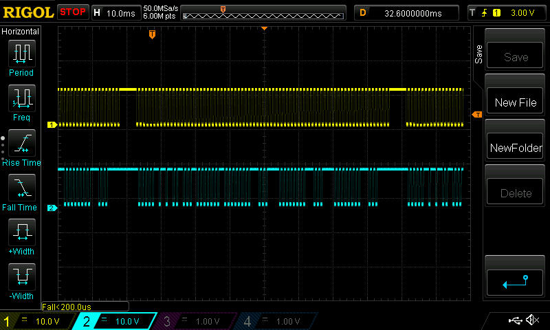

DSC PC-1404 keybus description.

### Summary:

1. [Description](#description)
2. [DSC_PC1404 PowerSeries keybus description](#keybus)

------------------------------------------------------------------------------------------------------------------
### Description:

[Back](#summary)

------------------------------------------------------------------------------------------------------------------
### Keybus electrical characteristics:

- Clock period : T = 1ms
- Max voltage : Umax = 12V (Logical 1)
- Min voltage : Umin = 0V (Logical 0)
- Pulses count: 74
- Packet length : ~74 ms
- Delay between packets : ~5ms
- Bit duration : 0.5ms (T/2)

##### Keybus consists of 4 wires:

- Red : +12v
- Yellow: Clock
- Green: Data
- Black : Gnd

##### Keybus oscillogram (click to enlarge):

 <!-- .element height="50%" width="50%" -->

Description:

| Pulse No | Represents | Description [ logical state ] | Additional info |
|:--------------|:----------------:|:----------------:|:----------------:|
|1.0| | | |
|1.1| | | |
|2.0| | | |
|2.1| | | |
|3.0| | | |
|3.1| | | |
|4.0| | | |
|4.1| | | |
|5.0| | | |
|5.1| | | |
|6.0| | | |
|6.1| | | |
|7.0| | | |
|7.1| | | |
|8.0| | | |
|8.1| | | |
|9.0| | | |
|9.1| | | |
|10.0| | | |
|10.1| | | |
|11.0| | | |
|11.1| | | |
|12.0| | | |
|12.1| | | |
|13.0| | | |
|13.1| | | |
|14.0| | | |
|14.1| | | |
|15.0| | | |
|15.1| | | |
|16.0| | | |
|16.1| | | |
|17.0| | | |
|17.1| | | |
|18.0| | | |
|18.1| | | |
|19.0| | | |
|19.1| | | |
|20.0| | | |
|20.1| | | |
|21.0| | | |
|21.1| | | |
|22.0| | | |
|22.1| | | |
|23.0| | | |
|23.1| | | |
|24.0| | | |
|24.1| | | |

**Unfortunatelly, not all functions of keybus were reversed, but we are working on that :)**

[Back](#summary)

------------------------------------------------------------------------------------------------------------------
