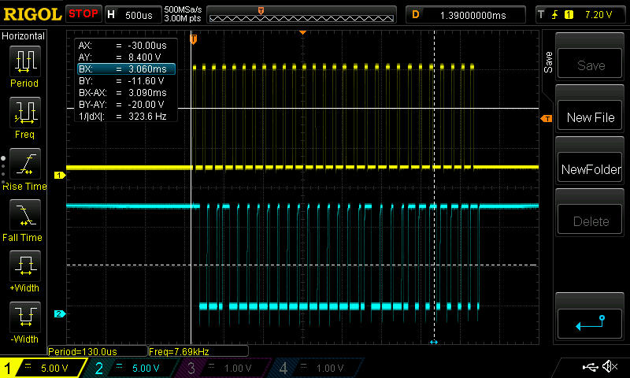
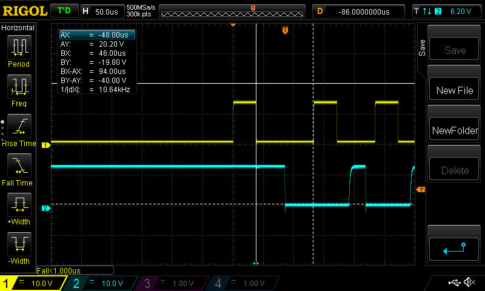

#Napco MAgnum 1008e keybus description.

### Summary:

1. [Description](#description)
2. [Napco Magnum 1008e keybus oscillograms](#oscillogram)
2. [Napco Magnum 1008e keybus description](#keybus)

------------------------------------------------------------------------------------------------------------------
### Description:

 <!-- .element height="50%" width="50%" -->
 <!-- .element height="50%" width="50%" -->

[Back](#summary)

------------------------------------------------------------------------------------------------------------------
### Keybus electrical / timing characteristics:

- Max voltage : Umax = 12V (Logical 1)
- Min voltage : Umin = 0V (Logical 0)
- Pulses count: 28
- Clock period and pulse timings:
  - First clock impulse : T = ~118us; Logical 1: ~40 us; Logical 0: ~78 us.
  - Default clock impulse : T = ~105us; Logical 1: ~40 us; Logical 0: ~66 us.
  - Clock timings could also be different (see [Anomalies](#anomalies)).
- Packet length : Clock : 3 ms; Data : 3 ms;
- Delays between packets :
  - Default: ~28.8 ms
  - During dialing: ~6.8 ms
  - Pushing buttons:  ~6.8 ms
- Delays between packet sequences (see [Sequences](#sequences)) :  

### Oscillograms:

  
Oscillograms

  

        
Zone shortening oscillogram

  #### Before connecting zone to ground:
   <!-- .element height="50%" width="50%" -->

  #### After connecting zone to ground:
   <!-- .element height="50%" width="50%" -->
  
  

  

        
Button push oscillogram

  #### Before button push:
   <!-- .element height="50%" width="50%" -->
  
  #### After button push:
   <!-- .element height="50%" width="50%" -->
  
  

  

        
7-Segment keypad indicator value oscillogram

  #### Indicator shows nothing:
   <!-- .element height="50%" width="50%" -->
  
  #### Indicator shows 4 zone is opened:
   <!-- .element height="50%" width="50%" -->

  

  

        
7-Segment keypad indicator value oscillogram

  #### Indicator shows nothing:
   <!-- .element height="50%" width="50%" -->
  
  #### Indicator shows 4 zone is opened:
   <!-- .element height="50%" width="50%" -->

  

  

        
Packet start oscillogram

  #### Packet start:
   <!-- .element height="50%" width="50%" -->
  
  

  

        
Different packet sequences oscillograms

  #### After key press or when dialing is happening:
   <!-- .element height="50%" width="50%" -->
  
  #### IDefault:
   <!-- .element height="50%" width="50%" -->

  

### Anomalies:

- When you push any button, the clock period for the pushed button prolongs for 20 us.
- When any zone is shorted:
  - the clock line packet length prolongs for ~660 us [from ~3ms to ~3.66ms]
  - the clock time length [**T***off*] prolongs for ~25us for all pulses 
  - the data line packet length prolongs for ~660 us [from ~3ms to ~3.66ms]
  - the data line packet length [**T***off*] prolongs for ~25us for all pulses (values can be different)
- Some time the packets could be sent in pairs. 

##### Keybus consists of 4 wires:

- Red : +12v
- Yellow: Clock
- Green: Data
- Black : Gnd

##### Keybus oscillogram (click to enlarge):

 <!-- .element height="50%" width="50%" -->

##### Keybus description (click to enlarge):

 <!-- .element height="50%" width="50%" -->

Description:

| Pulse No | Represents | Description [ logical state ] | Additional info |
|:--------------|:----------------:|:----------------:|:----------------:|
|1.0| | | |
|1.1| | | |
|2.0| | | |
|2.1| | | |
|3.0| | | |
|3.1| | | |
|4.0| | | |
|4.1|Remote panic | Triggered[0], not triggered[1] | Also could be invoked pushing [*/P] and [#] buttons simultaneously. |
|5.0| | | |
|5.1|Button B/A |Pushed[0], not pushed[1] | |
|6.0| | | |
|6.1|Button 9/F |Pushed[0], not pushed[1] | |
|7.0| | | |
|7.1|Button 8 |Pushed[0], not pushed[1] | |
|8.0| | | |
|8.1|Button 7 |Pushed[0], not pushed[1] | |
|9.0| | | |
|9.1|Button 6 |Pushed[0], not pushed[1] | |
|10.0| | | |
|10.1|Button 5 |Pushed[0], not pushed[1] | |
|11.0| | | |
|11.1|Button 4 |Pushed[0], not pushed[1] | |
|12.0| | | |
|12.1|Button 3 |Pushed[0], not pushed[1] | |
|13.0| | | |
|13.1|Button 2 |Pushed[0], not pushed[1] | |
|14.0| | | |
|14.1|Button 1 |Pushed[0], not pushed[1] | |
|15.0| | | |
|15.1| | | |
|16.0| | | |
|16.1| | | |
|17.0|Armed/Alarm LED |Led is off[0], Led is on[1] | |
|17.1| | | |
|18.0|Status LED |Led is off[0], Led is on[1] | |
|18.1| | | |
|19.0|Bypass LED |Led is off[0], Led is on[1] | |
|19.1| | | |
|20.0|Fire/Trouble LED |Led is off[0], Led is on[1] | |
|20.1| | | |
|21.0|Buzzer |Silent[0], beeping[1] | |
|21.1| | | |
|22.0|Zone   2,3,4,5,6,  8 |Zone is opened [0], zone is closed [1] |7-segment indicator |
|22.1| | | |
|23.0|Zone       4,5,6,  8 |Zone is opened [0], zone is closed [1] |7-segment indicator |
|23.1| | | |
|24.0|Zone   2,      6,  8 |Zone is opened [0], zone is closed [1] |7-segment indicator |
|24.1| | | |
|25.0|Zone   2,3, ,5,6,  8 |Zone is opened [0], zone is closed [1] |7-segment indicator |
|25.1| | | |
|26.0|Zone 1,  3,4,5,6,7,8 |Zone is opened [0], zone is closed [1] |7-segment indicator |
|26.1| | | |
|27.0|Zone 1,2,3,4,    7,8 |Zone is opened [0], zone is closed [1] |7-segment indicator |
|27.1| | | |
|28.0|Zone   2,3,  5,6,7,8 |Zone is opened [0], zone is closed [1] |7-segment indicator |
|28.1| | | |

**Unfortunatelly, not all functions of keybus were reversed, but we are working on that :)**

[Back](#summary)

------------------------------------------------------------------------------------------------------------------
